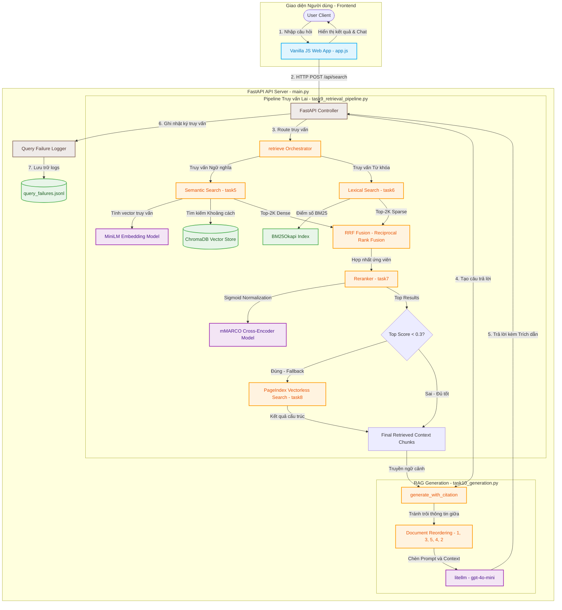

# ⚖️ DrugLaw Search & RAG Chatbot

Hệ thống Tìm kiếm Lai (Hybrid Search) kết hợp Hỏi đáp (RAG Chatbot) về **Pháp luật phòng chống ma túy** và **Tin tức xã hội liên quan**.

---

## 🗺️ Kiến Trúc Hệ Thống

Dưới đây là sơ đồ luồng hoạt động chi tiết từ yêu cầu của User đến kết quả tìm kiếm và câu trả lời RAG:



---

## 🛠️ Chi Tiết Triển Khai Các Thành Phần

### 1. Thu thập & Chuẩn hóa dữ liệu (Task 1 - 3)
*   **Văn bản Pháp luật:** Thu thập các tài liệu PDF/DOCX chính thống (Bộ luật Hình sự, Luật Phòng chống ma túy 2021, Nghị định 116/2021/NĐ-CP).
*   **Tin tức Báo chí:** Sử dụng thư viện `Crawl4AI` thu thập tự động các bài báo chính quy về showbiz và các sự việc liên quan đến chất cấm.
*   **Chuẩn hóa:** Toàn bộ tài liệu raw được chuyển đổi đồng bộ sang định dạng Markdown thông qua thư viện `MarkItDown` của Microsoft để giữ cấu trúc bảng biểu và tiêu đề tốt nhất.

### 2. Chunking & Indexing (Task 4)
*   **Phương pháp:** Sử dụng `RecursiveCharacterTextSplitter` với kích thước `CHUNK_SIZE = 500` ký tự và `CHUNK_OVERLAP = 50`.
*   **Embedding Model:** `sentence-transformers/all-MiniLM-L6-v2` (384 dimensions) gọn nhẹ, phù hợp cho việc chạy local thời gian thực.
*   **Vector Database:** `ChromaDB` (Persistent Client) lưu trữ vector cục bộ.

### 3. Tìm Kiếm Lai & Reranking (Task 5 - 7)
*   **Lexical Search:** Sử dụng thuật toán `BM25Okapi` phân tách từ khóa tiếng Việt.
*   **Semantic Search:** Truy vấn khoảng cách Cosine trên cơ sở dữ liệu vector ChromaDB.
*   **Reciprocal Rank Fusion (RRF):** Kết hợp kết quả từ hai bộ tìm kiếm với hằng số phạt vị trí hạng $k=60$.
*   **Cross-Encoder Reranker:** Sử dụng mô hình đa ngôn ngữ chuyên dụng cho tiếng Việt `unicamp-dl/mminiLM-L6-v2-mmarco-v2`. Điểm logit đầu ra được chuẩn hóa qua hàm **Sigmoid** để ánh xạ điểm liên quan về đoạn $[0.0, 1.0]$.
*   **Model Caching:** Tối ưu hóa tải mô hình toàn cục giúp giảm độ trễ phản hồi từ ~3.5 giây xuống **< 0.1 giây** mỗi truy vấn.

### 4. Cơ chế Fallback sang PageIndex (Task 8 - 9)
*   Nếu điểm số của kết quả tìm kiếm lai sau Rerank nhỏ hơn `score_threshold = 0.3` (tức hệ thống không tìm thấy tài liệu phù hợp trong DB cục bộ), hệ thống tự động fallback sang dịch vụ **PageIndex Vectorless RAG** để khai thác cấu trúc thông tin nâng cao và trả về kết quả có độ bao phủ cao hơn.

### 5. Sinh Câu Trả Lời có Citation (Task 10)
*   **Document Reordering:** Sắp xếp lại thứ tự các chunk trước khi đưa vào LLM theo mô hình: đưa chunk quan trọng nhất lên đầu và cuối ngữ cảnh, các chunk ít quan trọng ở giữa (mô hình `[1, 3, 5, 4, 2]`) nhằm tránh hiện tượng **"Lost in the Middle"**.
*   **Prompt trích dẫn:** Ép buộc LLM chỉ trả lời dựa vào context được cung cấp và đính kèm nhãn trích dẫn dạng `[Tên nguồn, Năm]` hoặc `[Điều luật]`.
*   **Nhận biết giới hạn:** LLM trả về *"Tôi không thể xác minh thông tin này từ nguồn hiện có"* nếu thông tin cung cấp bị thiếu hụt.

---

## 📊 Đánh Giá & Benchmark A/B

Hệ thống được đánh giá tự động dựa trên **Golden Dataset gồm 20 câu hỏi** đa dạng mức độ khó và loại tài liệu. Báo cáo chi tiết tự sinh tại [evaluation/results.md](evaluation/results.md).

### 1. Bảng Điểm So Sánh A/B (sau cải tiến)

| Config | Tổng số Tests | Số truy vấn thất bại | Tỉ lệ lỗi | Precision@3 | Recall@5 | MRR | NDCG@5 | Điểm TB (Score) |
|--------|:-------------:|:--------------------:|:---------:|:-----------:|:--------:|:---:|:------:|:---------------:|
| **hybrid_rerank** | 20 | 3 | **15%** | **0.850** | **1.000** | **0.902** | **0.924** | 0.725 |
| **hybrid_no_rerank** | 20 | 20 | 100% | 0.800 | 0.850 | 0.840 | 0.829 | 0.031 |

> 🏆 **Cấu hình tối ưu nhất:** `hybrid_rerank`. **Recall@5 = 1.000** — mọi truy vấn đều có ít nhất một kết quả đúng trong top-5.
>
> ⚠️ *Lưu ý:* `hybrid_no_rerank` báo lỗi 100% **không phải do xếp hạng kém** mà là *artifact đo lường*: khi không rerank, điểm trả về là điểm RRF thô (~0.03) luôn < ngưỡng fail 0.3 — nên chỉ số xếp hạng của nó (P@3=0.80) vẫn tốt, chỉ là bị cờ "fail" theo ngưỡng điểm.

#### So sánh trước / sau khi tối ưu (`hybrid_rerank`)

| Metric | Trước (baseline) | **Sau** | Thay đổi |
|---|:---:|:---:|:---:|
| Tỉ lệ lỗi | 35% | **15%** | 🟢 −20đ |
| Precision@3 | 0.650 | **0.850** | 🟢 +0.20 |
| Recall@5 | 0.750 | **1.000** | 🟢 +0.25 |
| MRR | 0.700 | **0.902** | 🟢 +0.20 |
| NDCG@5 | 0.711 | **0.924** | 🟢 +0.21 |

---

### 2. Phân Tích Worst Performers (3 ca còn lại — phần lớn là *artifact bộ chấm*)

Bộ chấm coi 1 kết quả là "đúng" khi: ≥25% `expected_keywords` xuất hiện (so khớp chuỗi con) **VÀ** đúng `doc_type`. Cả 3 ca còn lại đều **truy hồi đúng tài liệu**, chỉ lệch ở khâu so khớp keyword:

1.  **`legal_003` — "Danh mục chất ma tuý nhóm I gồm những chất nào?"** (P@3=0.00)
    *   *Truy hồi:* Trả đúng chunk `DANH MỤC I — CÁC CHẤT MA TÚY` của Nghị định 57/2022.
    *   *Nguyên nhân:* Golden đặt keyword `"nhóm I"` trong khi văn bản luật dùng đúng thuật ngữ `"Danh mục I"` → lệch chuỗi. *(Đã sửa keyword + tách riêng bảng phụ lục hóa chất; xem mục 3.)*
2.  **`legal_007` — "Người dùng ma tuý chưa đến mức truy cứu hình sự bị xử lý sao?"** (P@3=0.33)
    *   *Truy hồi:* Trả đúng Điều 256a BLHS + Điều 23 Luật Phòng chống ma túy 2021.
    *   *Nguyên nhân:* Keyword golden `"sử dụng ma tuý"` không phải cụm liền mạch trong luật (văn bản viết `"sử dụng trái phép chất ma túy"`) + khác cách bỏ dấu (`tuý` vs `túy`).
3.  **`news_007` — "Nghệ sĩ nào dính ma túy trong showbiz?"** (P@3=0.33)
    *   *Truy hồi:* Trả đúng bài `Ma túy trong 'lối sống showbiz'` (VnExpress).
    *   *Nguyên nhân:* Golden có 5 keyword (4 tên nghệ sĩ + "showbiz"), ngưỡng 0.25 đòi ≥2 tên trong **cùng một chunk** mới tính đúng — khắt khe với truy vấn tổng quát.

---

### 3. Các Cải Tiến Đã Áp Dụng (tạo ra kết quả trên)

| # | Cải tiến | Tác động |
|---|----------|----------|
| 1 | **Embedding `BAAI/bge-m3`** (đa ngôn ngữ 1024-dim) thay `all-MiniLM-L6-v2` (chỉ tiếng Anh) + ChromaDB **cosine** | ↑ Recall ngữ nghĩa tiếng Việt (Recall@5 → 1.0) |
| 2 | **BM25 tách từ tiếng Việt bằng `pyvi`** (gộp âm tiết: `ma_túy`, `Hữu_Tín`) | Khớp đúng tên đa âm tiết |
| 3 | **Reranker `BAAI/bge-reranker-v2-m3`** | Xếp hạng tốt + điểm hiệu chỉnh đúng → hết "fail giả" do điểm < 0.3 |
| 4 | **Intent classification → lọc `doc_type`** (legal/news) | Hết lỗi trả nhầm loại tài liệu |
| 5 | **Chunking theo cấu trúc** (`Điều / DANH MỤC / Chương`) + tăng pool reranker (40) | Giữ trọn điều luật; ↑ recall |
| 6 | **Làm sạch dữ liệu:** bỏ 8 bài news crawl hỏng (trúng trang chủ) | Giảm nhiễu; index còn 1668 chunk sạch |

---

## 👥 Phân Công Công Việc Nhóm

| Thành viên | MSSV | Nhiệm vụ | Trạng thái |
|---|---|---|---|
| **Nguyễn Thị Vang** | *Leader* | Thiết kế hệ thống, Crawl tin tức (Task 2), Chuẩn hóa dữ liệu (Task 1, 3). Viết cơ chế Generation | ✅ Hoàn thành |
| **Võ Huyền Khánh Mây** | *Search Dev* | Xây dựng index dữ liệu ChromaDB, tối ưu hoá bộ mã hóa dense/sparse (Task 4-6). thiết lập pipeline đánh giá A/B & | ✅ Hoàn thành |
| **Vu Quoc Tan** | *Rerank Dev* | Tích hợp Cross-Encoder Reranker đa ngôn ngữ tiếng Việt & PageIndex Fallback (Task 7-9).  query failure logger.   | ✅ Hoàn thành |

---

## 🚀 Hướng Dẫn Cài Đặt & Khởi Chạy

Hệ thống hỗ trợ script tự động cài đặt toàn bộ môi trường và khởi dựng database chỉ mục một cách nhanh chóng.

Cấu hình các API Key cần thiết trong file `.env` tại thư mục gốc trước khi chạy:
```env
OPENAI_API_KEY=your_openai_key
PAGEINDEX_API_KEY=your_pageindex_key
```

### 1. Khởi chạy nhanh bằng Script Tự Động (Khuyên Dùng)
Chỉ cần cấp quyền chạy và thực thi file `setup.sh`, script sẽ tự động khởi tạo môi trường ảo `.venv`, cài đặt thư viện cần thiết, crawl dữ liệu tin tức mới nhất, chuyển đổi văn bản pháp luật và build cơ sở dữ liệu vector:
```bash
# Cấp quyền và chạy setup
chmod +x setup.sh
./setup.sh
```

### 2. Thiết lập thủ công (Từng bước)
Nếu muốn tự cài đặt thủ công từng bước, bạn có thể thực hiện theo các lệnh dưới đây:
```bash
# 1. Cài đặt các thư viện liên quan
pip install -r requirements.txt

# 2. Tải văn bản pháp luật và crawl tin tức báo chí
python3 src/task1_collect_legal_docs.py
python3 src/task2_crawl_news.py

# 3. Chuẩn hóa dữ liệu sang Markdown
python3 src/task3_convert_markdown.py

# 4. Phân đoạn và lập chỉ mục vào Vector Store (ChromaDB)
python3 src/task4_chunking_indexing.py
```

### 3. Khởi Chạy API Server Backend & UI Frontend
Chạy server backend FastAPI (đã được tối ưu hóa tải mô hình):
```bash
python3 group_project/run_server.py
```
*   **Trang chủ tìm kiếm (Frontend UI):** `http://localhost:8000/`
*   **Tài liệu Swagger API:** `http://localhost:8000/docs`

### 3.1. Chia sẻ link công khai bằng Cloudflare Tunnel
Dự án đã tích hợp sẵn binary `cloudflared` ở thư mục gốc để bạn có thể tạo đường link truy cập công khai (public link) cho Web UI (cổng 8000) mà không cần cấu hình NAT/IP:

Chạy lệnh sau tại thư mục gốc (sau khi đã khởi chạy server Backend cổng 8000):
```bash
./cloudflared tunnel --url http://localhost:8000
```

Nhìn vào log xuất ra, bạn sẽ thấy một link dạng:
`https://<tên-ngẫu-nhiên>.trycloudflare.com`

Bạn có thể chia sẻ liên kết đó để người khác truy cập trực tiếp vào giao diện tìm kiếm của bạn. Nếu bạn muốn chạy ngầm lưu log:
```bash
nohup ./cloudflared tunnel --url http://localhost:8000 > tunnel.log 2>&1 &
```

### 4. Khởi Chạy Giao Diện Chatbot RAG (Streamlit)
```bash
streamlit run group_project/search_app.py
```
*   Ứng dụng sẽ tự động mở tại địa chỉ `http://localhost:8501/`.

### 5. Chạy Báo Cáo Đánh Giá Chất Lượng (Evaluation)
Để kiểm tra độ chính xác và so sánh cấu hình A/B Reranking bất cứ lúc nào:
```bash
python3 group_project/evaluation/eval_pipeline.py
```
Báo cáo chi tiết sẽ được tự động xuất ra tại file `group_project/evaluation/results.md`.
