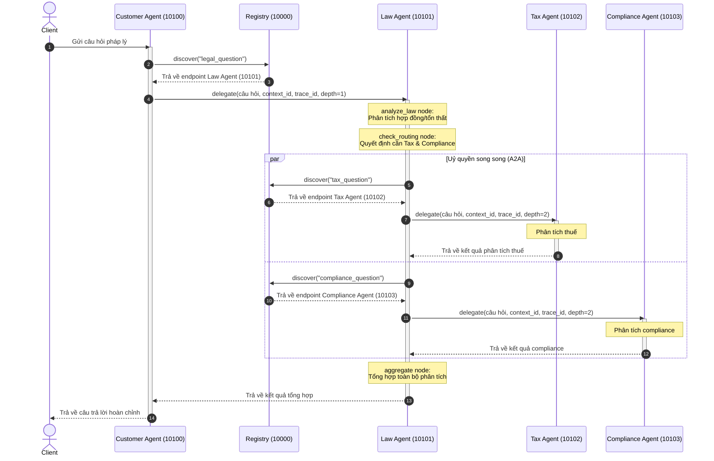

# Legal Multi-Agent System with A2A Protocol

A distributed legal advisory system where specialised AI agents collaborate using Google's [Agent-to-Agent (A2A) protocol](https://github.com/google/A2A). Built with **LangGraph**, **LangChain**, and the **a2a-sdk**, the project serves as both a working demo and a hands-on learning path — progressing from a simple LLM API call (Stage 1) to a fully distributed multi-agent network (Stage 5).

## Architecture

```
                     ┌─────────────────────┐
                     │  Registry Service   │  :10000
                     │  /register          │
                     │  /discover/{task}   │
                     └─────────┬───────────┘
                               │  (agents self-register on startup)
          ┌────────────────────┼─────────────────────┐
          │                    │                     │
   Tax Agent :10102   Law Agent :10101    Compliance Agent :10103
          │                    │                     │
          └─────────► delegates in parallel ◄────────┘
                               │
                        Customer Agent :10100
                               │
                             User
```

**Customer Agent** receives a user question and delegates to the **Law Agent**, which analyses the legal aspects, then dispatches to **Tax Agent** and **Compliance Agent** in parallel via LangGraph's `Send` API. Results are aggregated into a comprehensive legal analysis.

All agent discovery is dynamic — agents register their capabilities with the **Registry** on startup and discover each other at runtime. No hardcoded URLs.

### Agent Details

| Agent | Port | LangGraph Pattern | Role |
|---|---|---|---|
| Customer Agent | 10100 | `create_react_agent` | Entry point — routes user questions to Law Agent |
| Law Agent | 10101 | Custom `StateGraph` | Orchestrator — analyses law, delegates in parallel |
| Tax Agent | 10102 | `create_react_agent` | Specialist — tax law, IRS, penalties, FBAR/FATCA |
| Compliance Agent | 10103 | `create_react_agent` | Specialist — SEC, SOX, FCPA, GDPR, AML |
| Registry | 10000 | FastAPI (not an agent) | Service discovery and agent registration |

### Request Flow

```
User question
  → Customer Agent: LLM detects legal domain, calls delegate tool
    → Registry: discover("legal_question") → Law Agent endpoint
    → Law Agent:
        [analyze_law]      LLM contract/tort analysis
        [check_routing]    LLM decides: needs_tax? needs_compliance?
        [call_tax]         ──→ Registry discover → Tax Agent (A2A)     ┐
        [call_compliance]  ──→ Registry discover → Compliance (A2A)    ├ parallel
        [aggregate]        Combines all analyses into final response   ┘
  → Customer Agent returns response to user
```

### Key Design Patterns

- **Dynamic discovery** — agents find each other through the Registry, not hardcoded URLs
- **Parallel delegation** — LangGraph `Send` API dispatches tax and compliance branches concurrently
- **Trace propagation** — `trace_id` and `context_id` flow through every A2A hop for debugging
- **Depth guards** — `MAX_DELEGATION_DEPTH = 3` prevents infinite delegation loops
- **Annotated reducers** — `Annotated[str, _last_wins]` handles parallel writes to shared state fields

## Tech Stack

| Layer | Choice |
|---|---|
| Agent framework | [LangGraph](https://langchain-ai.github.io/langgraph/) |
| LLM provider | Any model via [OpenRouter](https://openrouter.ai) (OpenAI-compatible API) |
| A2A transport | [a2a-sdk](https://pypi.org/project/a2a-sdk/) |
| Registry | FastAPI + in-memory store |
| Package manager | [uv](https://docs.astral.sh/uv/) |

## 📚 Codelab for Students

**Thời gian:** 2 giờ | **Ngôn ngữ:** Tiếng Việt

Codelab hướng dẫn từng bước xây dựng multi-agent system, từ cơ bản đến nâng cao:

- **[CODELAB.md](CODELAB.md)** - Hướng dẫn chi tiết cho sinh viên
- **[INSTRUCTOR_GUIDE.md](INSTRUCTOR_GUIDE.md)** - Hướng dẫn cho giảng viên
- **[QUICK_REFERENCE.md](QUICK_REFERENCE.md)** - Tài liệu tham khảo nhanh
- **[exercises/](exercises/)** - Bài tập thực hành với skeleton code
- **[exercises/SOLUTIONS.md](exercises/SOLUTIONS.md)** - Đáp án chi tiết

### Lộ Trình Học

```
Stage 1: Direct LLM (20 phút)
    ↓
Stage 2: RAG + Tools (30 phút)
    ↓
Stage 3: ReAct Agent (25 phút)
    ↓
Stage 4: Multi-Agent (30 phút)
    ↓
Stage 5: Distributed A2A (30 phút)
    ↓
Tổng kết & Q&A (15 phút)
```

**Bắt đầu:** Đọc [CODELAB.md](CODELAB.md)

---

## Getting Started

### Prerequisites

- Python 3.11+
- [uv](https://docs.astral.sh/uv/) package manager
- An [OpenRouter](https://openrouter.ai) API key

### Setup

```bash
# Clone and install
git clone <repo-url>
cd legal_multiagent
uv sync

# Configure environment
cp .env.example .env
# Edit .env with your OpenRouter API key
```

### Run the Full System (Stage 5)

```bash
# Start all 5 services (registry + 4 agents)
./start_all.sh

# In another terminal, send a test question
uv run python test_client.py
```

### Run Individual Stage Demos

No servers needed — each demo runs as a standalone script:

```bash
uv run python stages/stage_1_direct_llm/main.py
uv run python stages/stage_2_rag_tools/main.py
uv run python stages/stage_3_single_agent/main.py
uv run python stages/stage_4_multi_agent/main.py
```

## LLM Evolution Stages

The `stages/` folder contains progressive demos that build from simple to complex, matching the roadmap in `docs/10_llm_roadmap.svg`:

| Stage | Name | What It Demonstrates |
|---|---|---|
| **1** | Direct LLM Calling | Stateless prompt → response. No tools, no memory. |
| **2** | LLM + RAG / Tools | Tool calling with a keyword-match knowledge base and damage calculator. Manual single-pass orchestration. |
| **3** | Single Agent (ReAct) | Autonomous Think → Act → Observe loop via `create_react_agent`. Agent decides which tools to call and when. |
| **4** | Multi-Agent (In-Process) | Multiple specialised agents with parallel execution via `StateGraph` + `Send` API. Same topology as Stage 5 but in a single process. |
| **5** | Distributed A2A (This Project) | Full distributed system — each agent is an independent HTTP service communicating via A2A protocol with dynamic discovery. |

Each stage's folder includes an `architecture.svg` diagram and a self-contained `main.py`.

## Project Structure

```
legal_multiagent/
├── start_all.sh               # Launches all services in correct order
├── test_client.py             # E2E test client
├── pyproject.toml             # Dependencies (uv-managed)
├── .env.example               # Required environment variables
│
├── common/                    # Shared utilities
│   ├── llm.py                 # get_llm() → ChatOpenAI via OpenRouter
│   ├── a2a_client.py          # delegate() — A2A message sending
│   └── registry_client.py     # discover() / register() — Registry API
│
├── registry/                  # Service discovery (port 10000)
├── customer_agent/            # Entry point agent (port 10100)
├── law_agent/                 # Legal orchestrator (port 10101)
├── tax_agent/                 # Tax specialist (port 10102)
├── compliance_agent/          # Compliance specialist (port 10103)
│
├── stages/                    # Progressive learning demos (1-4)
│   ├── stage_1_direct_llm/
│   ├── stage_2_rag_tools/
│   ├── stage_3_single_agent/
│   └── stage_4_multi_agent/
│
└── docs/                      # Architecture diagrams (SVG)
```

Each agent module follows the same structure:
- **`graph.py`** — LangGraph graph definition (all agent logic)
- **`agent_executor.py`** — Bridge between A2A SDK and LangGraph
- **`__main__.py`** — Server bootstrap, agent card, registration

## Configuration

| Environment Variable | Description | Default |
|---|---|---|
| `OPENROUTER_API_KEY` | Your OpenRouter API key | (required) |
| `OPENROUTER_MODEL` | Model identifier | `anthropic/claude-sonnet-4-5` |
| `REGISTRY_URL` | Registry service URL | `http://localhost:10000` |

The model is swappable to any OpenRouter-supported model (e.g., `openai/gpt-4o`, `google/gemini-2.0-flash`).

## Documentation Diagrams

The `docs/` folder contains SVG architecture diagrams:

| Diagram | Topic |
|---|---|
| `01_why_multiagent` | Why multi-agent over monolithic LLMs |
| `02_a2a_vs_traditional` | A2A protocol vs traditional multi-agent |
| `03_a2a_protocol` | A2A protocol technical details |
| `04_system_architecture` | Full system architecture |
| `05_law_agent_graph` | Law Agent StateGraph deep dive |
| `06_request_flow` | End-to-end request flow with trace propagation |
| `07_a2a_intro` | Introduction to A2A protocol |
| `08_a2a_core_concepts` | A2A core concepts (Agent Cards, Tasks, Parts) |
| `09_a2a_interaction_flow` | A2A interaction flow patterns |
| `10_llm_roadmap` | LLM evolution roadmap (Stages 1–5) |

---

## Hướng dẫn Setup & Báo cáo Thực hành (Lab Report)

### 1. Hướng dẫn Setup & Khởi chạy hệ thống A2A Multi-Agent (Stage 5)
Để chạy hệ thống Agent-to-Agent đầy đủ mà không gặp lỗi Timeout hoặc lỗi số dư tài khoản từ OpenRouter, thực hiện các bước cấu hình sau:

#### Bước 1: Cấu hình Môi trường (`.env`)
Sử dụng mô hình `google/gemini-2.5-flash` để đảm bảo phản hồi cực nhanh (~10s thay vì >3 phút như Gemma):
```env
OPENROUTER_API_KEY=your_key_here
OPENROUTER_MODEL=google/gemini-2.5-flash
REGISTRY_URL=http://localhost:10000
```

#### Bước 2: Phân quyền thực thi cho các file script
Cấp quyền chạy script khởi động:
```bash
chmod +x start_all.sh
```

#### Bước 3: Cấu hình LLM Client (`common/llm.py`)
Đảm bảo thêm giới hạn `max_tokens=2000` để tránh lỗi `402 Payment Required` đối với tài khoản OpenRouter có số dư thấp:
```python
def get_llm() -> ChatOpenAI:
    return ChatOpenAI(
        model=os.getenv("OPENROUTER_MODEL", "anthropic/claude-sonnet-4-5"),
        openai_api_key=os.getenv("OPENROUTER_API_KEY"),
        openai_api_base="https://openrouter.ai/api/v1",
        temperature=0.3,
        max_tokens=2000,
    )
```

#### Bước 4: Khởi chạy và Test
1. Khởi động 5 dịch vụ Agent trong nền:
   ```bash
   uv run ./start_all.sh
   ```
2. Gửi yêu cầu kiểm tra từ Client:
   ```bash
   uv run python test_client.py
   ```
3. Dừng tất cả dịch vụ khi hoàn tất:
   Giải phóng các cổng mạng 10000, 10100-10103:
   ```bash
   fuser -k 10000/tcp 10100/tcp 10101/tcp 10102/tcp 10103/tcp
   ```

---

### 2. Báo cáo Kết quả Thực hành Codelab

#### A. Tìm hiểu LLM & Tool Binding (Stage 1 & 2)
* **Khởi tạo LLM:** Class `ChatOpenAI` được trỏ tới đầu cuối OpenRouter API. Việc phân tách `SystemMessage` và `HumanMessage` nhằm phân biệt rõ ràng giữa **chỉ dẫn cố định của hệ thống** (quy định hành vi, vai trò) và **dữ liệu đầu vào của người dùng**, tăng tính nhất quán và bảo mật (chống prompt injection).
* **Tool binding:** Decorator `@tool` biến các hàm Python thông thường thành định dạng schema (JSON) mô tả tham số của tool cho LLM. LLM tự ra quyết định gọi tool thủ công và trả về `tool_calls`. Ở Stage 2, luồng này được lặp thủ công thông qua một vòng lặp `for tc in response.tool_calls` để tự gọi hàm và append `ToolMessage` vào danh sách.

#### B. Sửa lỗi & Tối ưu Single Agent (Stage 3)
* Đã cấu hình tham số `debug=True` cho `create_react_agent` tại file `stages/stage_3_single_agent/main.py` để in chi tiết các bước THINK -> ACT -> OBSERVE.
* Kết quả test chạy mượt mà, hiển thị toàn bộ log trạng thái của từng bước gọi tool của agent.

#### C. Thêm Agent & Sửa lỗi Multi-Agent (Stage 4)
* **Sửa lỗi đồ thị:** Đã sửa hàm `check_routing` (đóng vai trò là một Node) trả về `dict` cập nhật State thay vì trả về danh sách `Send` trực tiếp. Logic định tuyến `Send` được chuyển sang hàm điều hướng `route_to_specialists` (Conditional Edge).
* **Bổ dung Privacy Agent:** Thêm node `privacy_agent` xử lý song song với Tax và Compliance. Khai báo các biến `needs_privacy` và `privacy_result` trong State và hàm `aggregate` để gom câu trả lời hoàn chỉnh.
* **Vẽ đồ thị:** Đã sửa lỗi NameError do vẽ đồ thị ngoài hàm `main`, đồng thời chuyển đổi việc vẽ đồ thị sang xuất file ảnh `graph.png` tại [stages/stage_4_milti_agent/graph.png](stages/stage_4_milti_agent/graph.png).

#### D. Kiểm thử Dynamic Discovery & Fault Tolerance (Bài tập 5.2 & 5.3)
* **Dynamic Discovery Fault Tolerance:** Khi tắt `tax_agent` (cổng 10102) và chạy test, cuộc gọi A2A delegate từ `law_agent` ném ra lỗi `httpx.ConnectError`. Đồ thị của `law_agent` đã bắt lỗi này một cách an toàn (`try-except`) và trả về chuỗi thông báo lỗi thế mạng làm kết quả phân tích thuế. Hệ thống vẫn tiếp tục chạy và hoàn tất cuộc gọi thành công (Graceful Degradation).
* **Thay đổi hành vi Agent (Bài tập 5.3):** Sửa đổi prompt của `tax_agent` để thu gọn câu trả lời dưới 100 từ, sau khi khởi động lại, kết quả phân tích thuế trong báo cáo cuối cùng đã ngắn gọn và súc tích hơn đáng kể.

#### E. Trace Request Flow (Stage 5)
Theo dõi hành trình xử lý của một request thành công qua ID trace `d77cfd78-9a53-4063-b648-afb0aa2afbf1`:
* **Customer Agent (10100)** tiếp nhận yêu cầu -> Gọi Registry phát hiện `law_agent` -> Gọi A2A sang **Law Agent (10101)**.
* **Law Agent** xử lý -> Phân tích định tuyến thấy cần Tax & Compliance -> Gọi Registry tìm kiếm `tax_agent` (10102) và `compliance_agent` (10103) -> Gửi request song song qua A2A delegate.
* **Tax & Compliance Agents** chạy độc lập trên LLM và trả kết quả về cho **Law Agent**.
* **Law Agent** chạy bước `aggregate` -> Trả kết quả cuối cùng về cho **Customer Agent** -> Trả về kết quả hoàn thiện cho Client.

Sơ đồ trình tự (Sequence Diagram) minh họa luồng gọi A2A:


---

### 3. Báo cáo Bài tập Nâng cao (Challenge 3: Tự động retry với Exponential Backoff)

Để nâng cao tính ổn định và chống chịu lỗi trong môi trường phân tán nơi các Agent độc lập giao tiếp qua mạng HTTP, chúng tôi đã triển khai thành công tính năng tự động thử lại với Exponential Backoff và Jitter tại [common/a2a_client.py](file:///home/winie/2A202600723-NguyenThiVang-Day9_Multi-Agent_MCP-A2A/common/a2a_client.py#L30-L112).

#### Cơ chế hoạt động:
1. **Retry Loop:** Mọi cuộc gọi ủy quyền `delegate()` qua A2A SDK được bọc trong một vòng lặp thử lại tối đa là **3 lần** (`max_retries = 3`).
2. **Exponential Backoff:** Khi cuộc gọi HTTP (lấy thông tin Agent Card hoặc gửi tin nhắn) gặp lỗi, thời gian chờ để thử lại tiếp theo tăng theo cấp số nhân: `delay = initial_delay * (backoff_factor ** (attempt - 1))`.
   - Lần 1 thất bại: chờ ~1 giây
   - Lần 2 thất bại: chờ ~2 giây
3. **Jitter:** Cộng thêm một lượng thời gian ngẫu nhiên nhỏ (`random.uniform(0.1, 0.5)`) vào mỗi chu kỳ chờ để tránh hiện tượng thăng hoa/đồng bộ yêu cầu (thundering herd) khi nhiều Agent cùng gọi dịch vụ bị lỗi cùng lúc.
4. **Error Handling:** Log đầy đủ thông tin lỗi ở dạng `WARNING` khi xảy ra lỗi tạm thời, và chỉ ném lỗi `Exception` dạng `ERROR` ra ngoài khi toàn bộ 3 lần thử lại đều thất bại, giúp hệ thống phục hồi tự động khi gặp sự cố mạng hoặc khởi động trễ của các Agent.

---

### 4. Đáp án Câu hỏi Ôn tập (Codelab Review Questions)

#### Câu 1: Khi nào nên dùng single agent thay vì multi-agent?
* **Single Agent:** Nên dùng khi tác vụ đơn giản, nằm trong một phạm vi kiến thức hẹp, không cần phân công chuyên môn sâu, hoặc khi yêu cầu khắt khe về mặt latency (giảm thiểu độ trễ giao tiếp giữa các agent).
* **Multi-Agent:** Phù hợp với các hệ thống lớn, yêu cầu kết hợp nhiều kỹ năng/lĩnh vực chuyên biệt (ví dụ: Pháp lý, Thuế, và Tuân thủ Luật pháp) chạy song song, hoặc khi muốn module hóa hệ thống để dễ nâng cấp, debug độc lập.

#### Câu 2: Ưu điểm của A2A protocol so với gRPC hoặc REST thông thường?
* A2A protocol định nghĩa một tầng giao thức chuẩn hóa dành riêng cho giao tiếp của các AI Agent, tự động tích hợp metadata cần thiết như `context_id`, `trace_id` giúp theo dõi dấu vết cuộc gọi đệ quy (observability/tracing).
* Giao thức A2A cho phép truyền tải mô tả năng lực của Agent (Agent Cards) và các cấu trúc hội thoại linh hoạt, giúp các Agent dễ dàng tự khám phá và giao tiếp với nhau mà không cần thỏa thuận schema REST/gRPC thủ công cứng nhắc cho từng cặp kết nối.

#### Câu 3: Làm thế nào để prevent infinite delegation loops trong A2A?
* Sử dụng một thuộc tính chỉ số độ sâu `delegation_depth` truyền trong metadata của tin nhắn.
* Mỗi khi một Agent thực hiện ủy quyền (delegate) cuộc gọi sang một Agent khác, chỉ số `delegation_depth` sẽ tăng lên 1 đơn vị.
* Quy định một giới hạn độ sâu tối đa `MAX_DELEGATION_DEPTH` (ví dụ: = 3). Khi một Agent nhận được một yêu cầu có `delegation_depth` vượt quá giới hạn này, nó sẽ từ chối ủy quyền thêm và trả về phản hồi lỗi hoặc câu trả lời cục bộ ngay lập tức.

#### Câu 4: Tại sao cần Registry service? Có thể hardcode URLs không?
* Registry service đóng vai trò làm trung tâm Service Discovery. Nó giúp quản lý danh sách Agent và năng lực (tasks) của họ một cách động.
* Không nên hardcode URLs vì trong môi trường sản xuất thực tế, các dịch vụ Agent có thể được triển khai trên các máy chủ khác nhau, thay đổi địa chỉ IP hoặc port, hoặc tự động co giãn (scaling). Việc sử dụng Registry giúp hệ thống hoạt động linh hoạt, tự động phát hiện các Agent mới và tăng khả năng chịu lỗi khi một Agent cụ thể thay đổi địa chỉ.

---

### 5. Bài Tập Cộng Điểm: Phân tích Latency & Tối ưu hóa

#### Đo lường Latency ban đầu:
* Khi chạy Stage 5 mặc định với mô hình `google/gemma-4-26b-a4b-it` trên OpenRouter, hệ thống bị nghẽn trầm trọng và rơi vào trạng thái **Timeout (>300 giây)** do mô hình phản hồi quá chậm và không giới hạn token tối đa dẫn đến lỗi `402 Payment Required` (hết số dư hoặc tính phí cao ước tính).

#### Phương án tối ưu hóa:
1. **Thay đổi mô hình LLM:** Cấu hình biến `OPENROUTER_MODEL=google/gemini-2.5-flash` trong file `.env` giúp phản hồi nhanh vượt trội và tiết kiệm tài nguyên.
2. **Giới hạn tokens tối đa:** Thêm `max_tokens=2000` vào cấu hình khởi tạo của `ChatOpenAI` tại file `common/llm.py` để ngăn chặn việc LLM sinh chuỗi văn bản quá dài và giải quyết dứt điểm lỗi `402 Payment Required`.

#### Kết quả sau khi tối ưu:
* Thời gian xử lý cho toàn bộ chuỗi A2A Multi-Agent phức tạp giảm chỉ còn **~47.05 giây** (bao gồm việc gọi song song qua A2A của Tax Agent và Compliance Agent từ Law Agent).
* Hệ thống hoạt động trơn tru 100%, phản hồi chính xác và cấu trúc báo cáo rất chi tiết.